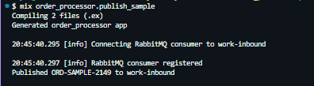

# Order Processor

A small Elixir/OTP application that consumes order messages from RabbitMQ, process them through a GenServer-backend worker and persists the results to PostgreSQL using Ecto.

The app accepts orders with one or more line items, calculates line totals and the overall order total then stores the order and its items in a single database transaction.

## Requirements

- Elixir 1.20+
- Erlang/OTP 28+
- Docker
-Task

The app uses the PostgreSQL and RabbitMQ services provided by the company.

## Getting Started

From the root of the homework repository, start PostgreSQL and RabbitM!:  
```
task init
```

This starts the provided Docker containers and configures:  
- PostgreSQL on `localhost:5433`
- RabbitMQ on `localhost:5672`
- RabbitMQ vhost: `homework`
- Exchange: redacted
- Queue: `work-inbound`
- Routing key: `inbound`

Move into the Elixir application:  
```
cd order_processor
```

Install dependencies:  
```
mix deps.get
```

Create the development database:  
```
mix ecto.create
```

Run migrations:  
```
mix ecto.migrate
```

Start the application:  
```
iex -S mix
```

When the application starts, the RabbitMQ consumer connects to the `work-inbound` queue and waits for messages.

## Publishing a Sample Order
A mix task is included for publishing a sample order:  
```
mix order_processor.publish_sample
```

  
(The exact `event_id` and `order_number` will vary on each run due to `System.unique_integer/1` so the task can be run more than once.)

The application calculates:
```
MUG-BLUE
2 x 1500 = 3000 cents

STICKER
3 x 250 = 750 cents

Order Total = 3750 cents
```

## Application Flow

The main processing path is:  
```
RabbitMQ  
    ↓  
RabbitConsumer
    ↓   
OrderWorker (GenServer)
    ↓
Orders
    ↓
Ecto / PostgreSQL 
```    

## Rabbit Consumer
`OrderProcessor.RabbitConsumer` subscribes to the provided `work-inbound` RabbitMQ queue. Messages are manually acknowleged so they are not removed from RabbitMQ until processing succeeds.

The consumer currently handles messages as:  
- Valid order: process and ACK
- Malformed JSON: reject without requeue
- Invalid order: reject without requeue
- Unexpected worker exit: NACK and requeue

The consumer uses a prefetch count of `1`, which matches the current single-worker design and keeps processing simple.

## OrderWorker

`OrderProcessor.OrderWorker` is a GenServer supervised by the application. The RabbitMQ consumer sends each decoded order to the worker using `GenServer.call/2`. The worker delegates the actual order processing to the `Orders` module and keeps in-memory counts of successful and failed attempts. These counters are intentionally not persistent leaving PostgreSQL the source of the truth.

## Orders

`OrderProcessor.Orders` contains the main domain logic.

It:
- Validates incoming item data
- Calculates each line total
- Calculates the complete order total
- Builds Ecto changesets
- Persists the order and its items

Order creation uses `Ecto.multi` so the order and all of its items are stored in one db transaction. If any item fails validation, the entire transaction is rolled back. 

## Database Design
The application uses two tables:
```
orders
------
id
event_id
order_number
customer_email
total_cents
processed_at
inserted_at
updated_at

and:

order_items
-----------
id
order_id (foreign key referencing orders.id)
sku
quantity
unit_price_cents
line_total_cents
inserted_at
updated_at

An order has many order items, and an order item belongs to one order.
Deleting an order aslo deletes its associated items
```

## Money
Monetary values are stored as integer cents rather than floating point values to avoid precision issues and keeps the calculations deterministic.

## Idempotency
Each incoming message contains an `event_id` which has a unique database constraint and is used to make message processing idempotent. If the same event is delivered more than once, the delivery creates the order and later deliveries return the already existing order rather than creating duplicates. Further, a duplicate `order_number` with a different `event_id` is still treated as an error because it represents a different event attempting to create the same business order. The database uniqueness constraint remains the final protection against concurrent duplicate processing.

## Supervision
The application uses a standard OTP supervision tree:
```
OrderProcessor.Supervisor
↳ OrderProcessor.Repo
↳ OrderProcessor.OrderWorker
↳ OrderProcessor.RabbitConsumer
```
The supervisor uses a `:one_for_one` strategy so unexpected failures in a child process can be restarted without restarting the other children. The RabbitMQ consumer is disabled during normal automated tests and started explicitly by the integration test.

## Testing
Create and migrate the test db:
```
MIX_ENV=test mix ecto.create
MIX_ENV=test mix ecto.migrate
```

Run the test suite:
```
mix test
mix test --trace (descriptive output)
mix test --cover (with coverage)
```

The test suite covers:
- Successful order processing
- Calculated order and line totals
- Transactional rollback for invalid items
- Duplicate event idempotency
- Conflicting order numbers
- GenServer success and failure tracking
- RabbitMQ end to end processing
- Malformed RabbitMQ messages
- Invalid RabbitMQ orders
- Continued consumption after rejected messages

The RabbitMQ integration test uses the real provided queue rather than mocking the AMPQ client.

## Design Decisions
### Plain Mix application instead of Phoenix
In the interest of time, the application does not expose an HTTP interface. Phoenix would add functionality that isn't needed at the moment. The supervised Mix application keeps the focus on OTP, RabbitMQ and persistence.

### Single GenServer worker
The current implementation process works through one GenServer. This keeps the concurrency model easy to reason about while meeting the requirements of the exercise. For higher throughput, my next step would be a supervised worker pool.

### Ecto.Multi for persistence
An order and its items should either all persist or none at all. `Ecto.Multi` makes that transaction boundary explicit and also works well with a dynamic number of order items.

### Database constraints in addition to validations
Changesets validate input before persistence, but important invariants such as unique event IDs / order numbers and foreign key relationships are also enforced by PostgreSQL. The database remains responsible for protecting the data even if application level validation is bypassed or concurrent workers race with one another. 

### Manual RabbitMQ acknowledgements
Messages are acknowledged only after successful processing and known invalid messages are rejected without requeueing so they do not create an endless processing loop. Unexpected processing failures are currently requeued.

### What I would build next
I would love to further explore:
- Multiple supervised workers for concurrent processing
- Bounded retry handling
- A RabbitMQ dead letter queue for messages that repeatedly fail
- Worker identity and processing attempt tracking for better observability
- Stronger RabbitMQ connection recovery testing
- Telemetry and application metrics
- Structured logging and correlation IDs
- Environment based configuration for credentials
- Additional integration testing around RabbitMQ channel failures
- Graceful shutdown behavior for in-flight messages

One limitation of the current retry strategy is that unexpected failures are requeued without a retry limit. In a production system I would use bounded retries and a dead letter queue to avoid poisonous messages from cycling indefinitely.

## Resetting the Infrastructure
Tear down the provided Docker infrastructure and recreate PostgreSQL and RabbitMQ from a clean slate.
From the repository root:
```
task destroy
task init
```

## Thank You
Thanks for the opportunity to work through this exercise. This was my first time working with Elixir, OTP and RabbitMQ and I had a fantastic time learning them while putting this all together. I appreciate the chance to build something new and I'm looking forward to talking through the decisions I made along the way.
